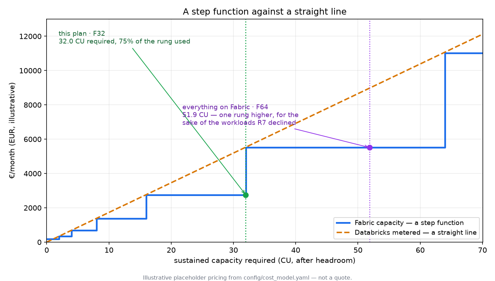

# Synapse → Fabric or Databricks: the decision, on one page

*The page to put on a screen. Everything else in this repo exists to defend it.*

> Euro figures are illustrative placeholders shaped like list pricing, not quotes.
> Capability claims are dated and must be re-checked against current vendor
> documentation. See [ADR-0006](design/decisions/0006-numbers-carry-provenance.md).

---

## The shape

```
   THE SYNAPSE ESTATE                THE LADDER                    WHERE IT LANDS
                                                            ┌─────────────────────┐
 dedicated SQL pool  ──┐        R1  residency & clearance   │  FABRIC             │
   tables, procs,      │        R2  T-SQL surface        ┌─▶│  warehouse          │
   transactions        │        R3  streaming semantics  │  │  lakehouse          │
                       │        R4  sub-second telemetry │  │  data factory       │
 serverless views    ──┤        R5  ML lifecycle         │  │  eventhouse         │
   over ADLS           │        ───────────────────────  │  │  ONE PRE-PAID       │
                       │         constraints eliminate   │  │  CAPACITY (F-SKU)   │
 Spark notebooks     ──┼──────▶                          │  └─────────────────────┘
   PySpark, ML         │        R6  Direct Lake premium   │  ┌─────────────────────┐
                       │        R7  economics, capacity-  │  │  DATABRICKS         │
 pipelines           ──┤            aware                 ├─▶│  sql warehouse      │
   orchestration       │        R8  step-boundary review  │  │  jobs / workflows   │
                       │        R9  locality (advisory)   │  │  structured stream. │
 streams             ──┘        ───────────────────────   │  │  METERED, per DBU   │
   Event Hub             economics chooses, among         │  └─────────────────────┘
                         survivors only                   │  ┌─────────────────────┐
                                                          └─▶│  STAYS ON SYNAPSE   │
                                                             │  nothing survived   │
                                                             └─────────────────────┘
```

---

## The one idea

**Databricks is metered. Fabric is a pre-paid capacity. That is not a price
difference, it is a shape difference, and it changes what the question even is.**

|  | Databricks | Fabric |
|---|---|---|
| Fixed cost | ~none | the whole F-SKU |
| Marginal cost of one more workload | what it consumes | **€0 — until the capacity saturates** |
| Then | still linear | **the price of the next rung** |
| Can you price one workload on its own? | yes | **no** |

Three consequences, and they are the whole repo:

1. **A workload's platform depends on what else is on the platform.** The same
   notebook is free on Fabric with headroom and costs a full rung without it.
2. **Unused headroom is the cheapest compute in the estate.** An F32 at 50% is an
   F32 paid for in full. The only way to use it is to put something on it.
3. **The marginal workload that forces a rung pays for the whole rung** — which is
   why *"just add it to Fabric"* is sometimes the most expensive sentence in an
   architecture review.



---

## The ladder, in order

The order **is** the design. R1–R5 return reasons and never numbers; R7 is the
first rule that can see a price ([ADR-0002](design/decisions/0002-constraints-before-economics.md)).

| | Rule | Eliminates when | Why it is a constraint and not a weight |
|---|---|---|---|
| **R1** | Residency & clearance | the platform has no home in an allowed region, or the classification is cleared for the other platform | A regulator does not accept a cheaper option |
| **R2** | T-SQL surface | the workload is stored procedures or multi-table transactions and the target hosts neither | It is a rewrite of how consistency is achieved, not a dialect difference — **measured** in `reports/simulation.md` |
| **R3** | Streaming semantics | the window must be restated by event time, or the sink must be exactly-once, and the engine does neither | An ingestion-time engine is not a cheaper event-time engine — **measured** |
| **R4** | Sub-second telemetry | high-cardinality telemetry at sub-second, on an engine not shaped for it | "Possible with enough warm compute" is a way of saying wrong engine |
| **R5** | ML lifecycle | tracking, registry and a served endpoint are needed and thin | A judgement, and marked as one |
| **R6** | Direct Lake premium | *(chooses)* a semantic model reading Delta in place is worth a bounded premium | No import refresh to fail, no DirectQuery round trip |
| **R7** | Economics | *(chooses)* cheapest survivor, **against a capacity that moves** | See the one idea above |
| **R8** | Step boundary | *(reviews)* is the rung we landed on the one to own? | R7 fills greedily and stops one rung too high sometimes |
| **R9** | Locality | *(advises)* shortcut, do not copy | A second physical copy appears on neither platform's bill |

---

## What the estate does

Run `make decide` for the current numbers; `reports/plan.md` carries the reason in
every row. The shape of the answer:

- **The answer is "both".** Not as a hedge — as an outcome. Streams split across
  *both* platforms for opposite reasons: telemetry and clickstream to Fabric
  because they need sub-second on append-only data, stock movements to Databricks
  because they need event-time restatement.
- **The dedicated SQL pool goes to Fabric almost entirely**, and not for a
  preference: transactional T-SQL is a capability Databricks does not host, so R2
  settles it before economics is consulted.
- **Batch notebooks split on the capacity boundary alone.** Some ride free
  headroom; the two that would have stepped F32 to F64 are metered instead.
- **One workload has no home.** `STR_PAYMENTS` needs event-time restatement, which
  rules out Fabric, and carries a restricted classification cleared only for
  Fabric, which rules out Databricks. It stays on Synapse until one of those two
  facts changes — and the register says exactly which two.

---

## The number nobody puts on the slide

Over a two-year horizon the **migration is the larger half of the bill, and it is
very nearly identical on either platform** — it differs only where a T-SQL surface
has to be rewritten rather than moved.

The platform choice moves the smaller half. That does not make it unimportant: run
cost is the half that never stops, and it compounds. But a Fabric-versus-Databricks
argument that never says this out loud is an argument with a missing premise, and
it is usually being had by people who would rather discuss platforms than
sequencing.

---

## How to disagree

Every number that decides anything is in `config/`, and the plan re-renders:

| You think | Change |
|---|---|
| Fabric warehouse burns more/less capacity than that | `cost_model.yaml` → `fabric.cu_hours_per_compute_hour` |
| The reservation discount is wrong | `cost_model.yaml` → `fabric.reservation_discount` |
| 75% headroom is too conservative | `policy.yaml` → `capacity.headroom` |
| A rewrite is acceptable, price it instead of eliminating | `policy.yaml` → `tsql.eliminate_when_surface_unsupported: false` |
| Fabric's ML lifecycle is good enough now | `platforms.yaml` → `fabric.capability.ml_lifecycle: true` |
| Direct Lake is not worth a premium | `policy.yaml` → `semantics.max_premium_ratio: 1.0` |

Then `make decide`, and read what moved. The conversion factors under
`cost_model.yaml` are the least defensible numbers here and the ones that move the
answer most — which is why they are in one file, labelled, rather than spread
through the code.
